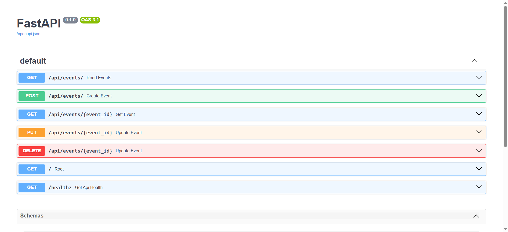
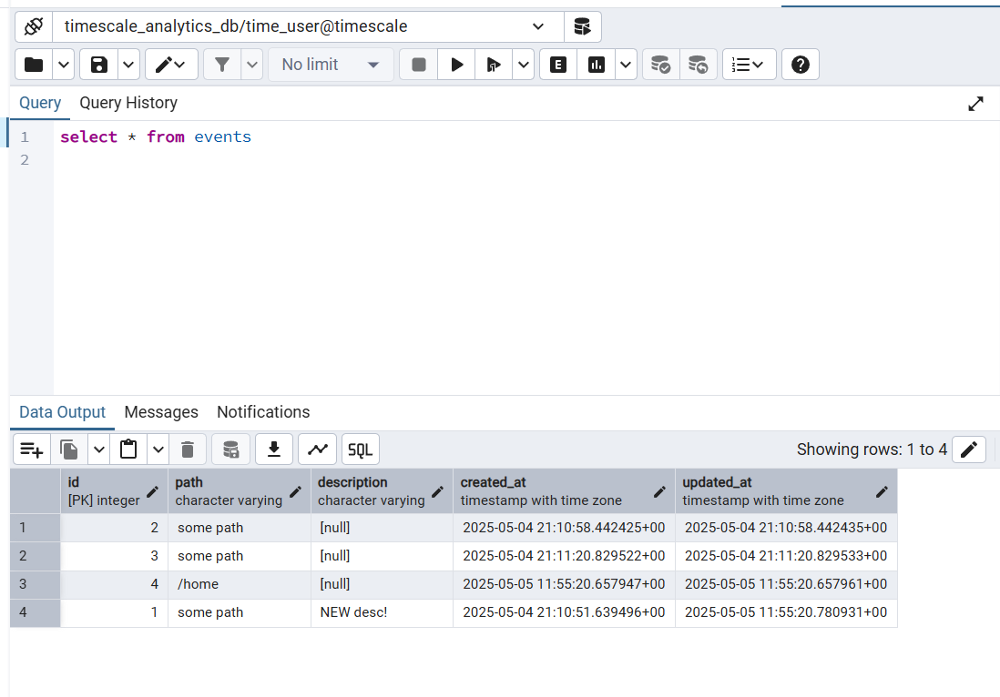

### This repo contains FastAPI dockerized project with Postgres db

What's used in this project:
1. **FastAPI** - API framework - app location http://127.0.0.1:8002, documentation http://127.0.0.1:8002/docs
2. **Docker & Docker Compose** - for app containerization

**Docker:**
1. To build image with docker `docker build -t analytics-api -f Dockerfile .` -> run project `docker run analytics-api` (builds and runs single image)
2. Better approach - **use Docker Compose** - commands from point 1 are moved to docker compose file (with additional setup), need to run `docker compose up` -> `docker compose down`

**Docker compose commands to run:**
- `docker compose up` or `docker compose up --build` (to rebuild images) or `docker compose up --watch` (to watch for changes in dockerfile & requirements and rebuild images)
- `docker compose down` or `docker compose down -v` (to remove volumes)
- `docker compose run app bin/bash` (to enter app cmd) or `docker compose run app python` (to enter app python shell)

**DB access (via dockerized PGAdmin)**:
- Login to PGAdmin at http://localhost:5050/ (admin@example.com/admin) 
- Add New Server - General: Name Timescale, Connection: Host db_service, Port 5432, Username time_user, Password time_pw
- Check created tables `SELECT table_name
FROM information_schema.tables
WHERE table_schema = 'public'` or run query

Note: When recreating requirements.txt - delete `pywin` (windows-only package)

Swagger documentation

DB example results
